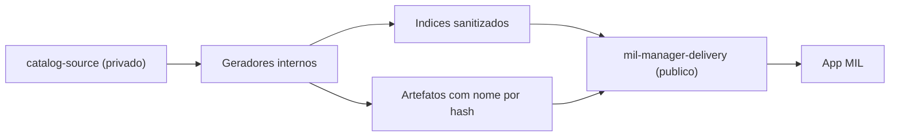

# Arquitetura de Publicacao Sanitizada v1

## Objetivo

Separar claramente:

- codigo do aplicativo
- gestao privada do catalogo
- entrega publica dos artefatos consumidos pelo app

sem quebrar o fluxo atual de instalacao em console e emuladores.

## Repositorios

### 1. `mil-manager` publico

Responsabilidades:

- codigo-fonte do app
- releases do `mil_manager.nro`
- changelog e documentacao
- exemplos de configuracao

Nao deve conter:

- URLs reais de armazenamento
- tabelas privadas de mapeamento
- catalogo bruto de producao

### 2. `mil-manager-catalog` privado

Responsabilidades:

- `catalog-source/`
- painel administrativo
- fontes externas e internas
- mapeamento de ativos
- geradores de indices
- automacao de publicacao

Conteudo esperado:

- `catalog-source/catalog-metadata.json`
- `catalog-source/entries/*.json`
- `catalog-source/cheats-sources.json`
- `catalog-source/saves-sources.json`
- `catalog-private/assets-map.json`
- `tools/generate-index.py`
- `tools/generate-cheats-index.py`
- `tools/generate-saves-index.py`
- `tools/publish-delivery.py`

### 3. `mil-manager-delivery` publico

Responsabilidades:

- receber apenas a saida final sanitizada
- servir indices e artefatos para o app

Conteudo esperado:

- `index.json`
- `cheats-summary.json`
- `cheats-index.json`
- `saves-index.json`
- `thumbs/`
- `assets/translations/`
- `assets/mods/`
- `assets/cheats/`
- `assets/saves/`

## Fluxo de publicacao



## Modelo de dados publico

### Principios

1. Nenhum `downloadUrl` real aparece no JSON.
2. Nenhum nome publicado depende do nome do jogo.
3. O cliente recebe apenas o suficiente para:
   - listar
   - pesquisar
   - baixar
   - validar hash

### Campos base de asset

```json
{
  "assetId": "cheat-01006a800016e000-06646fddd47a619f-main",
  "assetType": "cheatText",
  "contentHash": "sha256:...",
  "size": 12345,
  "revision": "2026.03.27.1",
  "relativePath": "assets/cheats/13/13aa9d....txt"
}
```

## Estrategia por tipo de conteudo

### Traducoes e modificacoes

- manter pacote ZIP por item
- `index.json` aponta para `assetId` e `relativePath`
- nome publico do ZIP vira hash

### Trapaças

- `cheats-summary.json` para browse e pesquisa
- `cheats-index.json` para detalhes por titulo/build
- instalacao baixa apenas o `.txt` individual selecionado
- nenhum `cheats-pack.zip` e necessario na arquitetura final

### Salvamentos

- `saves-index.json` lista variantes
- instalacao baixa apenas o ZIP da variante escolhida
- nome publico por hash

### Thumbs

- thumbs continuam separados
- nome publicado por hash da imagem
- cache local por hash

## Layout sugerido no delivery

```text
index.json
cheats-summary.json
cheats-index.json
saves-index.json
thumbs/
  1a/
    1a8c....img
assets/
  translations/
    10/
      10fa....zip
  mods/
    22/
      22bc....zip
  cheats/
    3f/
      3f17....txt
  saves/
    7e/
      7e90....zip
```

## Cache local no app

O app deve continuar usando:

- `sdmc:/switch/mil_manager/cache/index.json`
- `sdmc:/switch/mil_manager/cache/cheats-summary.json`
- `sdmc:/switch/mil_manager/cache/cheats-index.json`
- `sdmc:/switch/mil_manager/cache/saves-index.json`

E os downloads finais passam a ser armazenados por hash:

- `sdmc:/switch/mil_manager/cache/assets/<hash>`

## Compatibilidade durante migracao

### Etapa A

- app aceita:
  - `downloadUrl`
  - `assetId + relativePath`

### Etapa B

- catalogo privado publica ambos

### Etapa C

- app validado em:
  - console
  - Ryujinx
  - Eden

### Etapa D

- JSON publico remove `downloadUrl`

## Workflows sugeridos

### No catalogo privado

1. validar fontes
2. gerar indices
3. gerar artefatos sanitizados
4. enviar para `mil-manager-delivery`
5. opcionalmente abrir PR ou push direto

### No delivery publico

1. receber commit de artefatos
2. publicar Pages ou branch estatica

## Riscos conhecidos

1. Isso ofusca, mas nao impede engenharia reversa do cliente.
2. Se o endpoint final for publico, um usuario determinado ainda pode baixar os arquivos.
3. O ganho real aqui e:
   - nao expor origem real
   - nao manter links diretos no JSON publico
   - reduzir friccao para raspagem simples

## Recomendacao futura

Depois que a arquitetura sanitizada estiver estavel:

- mover `mil-manager-delivery` para storage com URL assinada ou proxy
- manter o schema publico com `assetId` e `relativePath` logico
- deixar o backend resolver a entrega real
